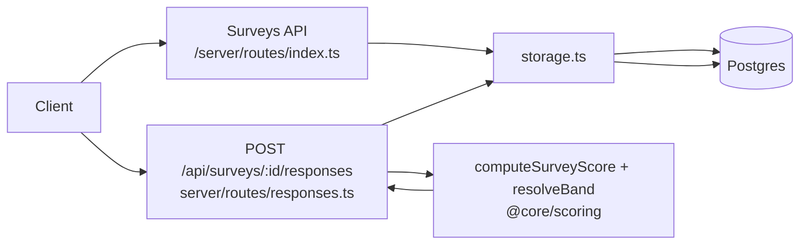

# API Map

Overview of active API endpoints, grouped by feature area, with request/handler/storage flow.

## Surveys
- GET/POST `/api/surveys`
- GET `/api/surveys/:id`
- PUT `/api/surveys/:id`
- POST `/api/surveys/:id/responses`

## AI
- POST `/api/parse-document`
- POST `/api/generate-survey`
- POST `/api/generate-scoring-config`
- POST `/api/generate-text`
- POST `/api/adjust-tone`
- POST `/api/questions/analyze`
- POST `/api/chat`
- POST `/api/ai-chat`

## Static/health/misc
- (As defined in `server/routes/index.ts` / swagger) – not the focus here.

## Request → Handler → Storage



## AI request path

```mermaid
flowchart LR
  Builder[Builder/Client AI call] --> AIRoute[/api/ai/* routes\nserver/routes/ai.ts]
  AIRoute --> AIService[aiService.ts\nprompt + guardrails]
  AIService --> Model[External model]
  Model --> Validator[Zod schemas\nserver/schemas/ai.ts + forbidden key scan]
  Validator --> BuilderResponse[Sanitized JSON to client]
```

## File references
- Surveys/Responses routes: `server/routes/responses.ts`, `server/routes/index.ts`
- AI routes: `server/routes/ai.ts`
- Storage/DB: `server/storage.ts`, `server/db.ts`, schema in `shared/schema.ts`
- Scoring: `server/utils/scoring.ts`, band resolver `src/core/scoring/resolveBand.ts`
- AI service: `server/aiService.ts`, schemas `server/schemas/ai.ts`
