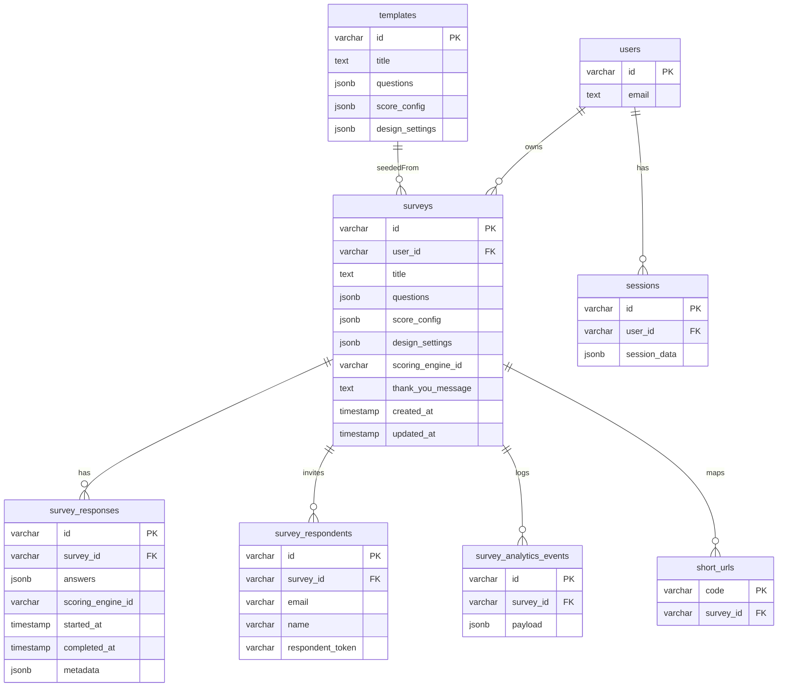
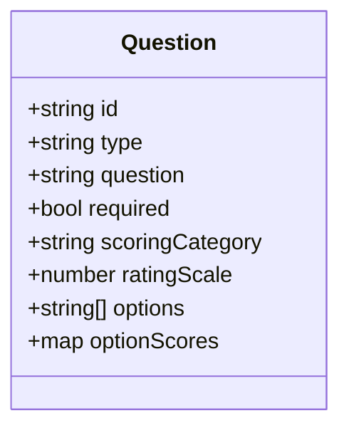
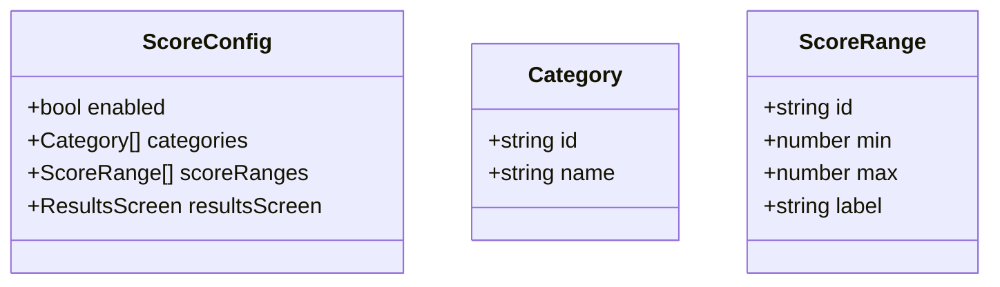
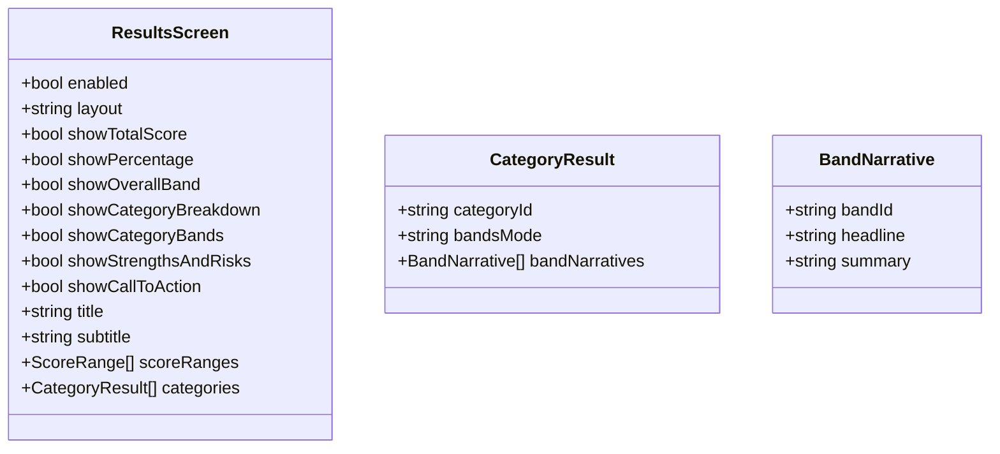
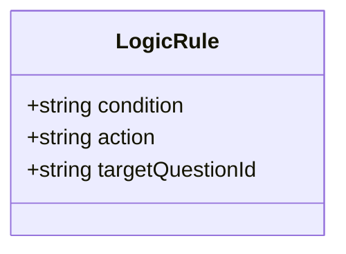
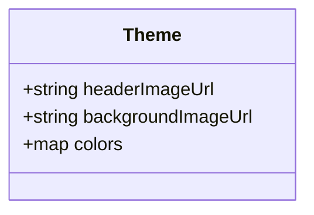

# Data Model

This page documents the relational schema (ERD) and key JSON structures used by Evalia.

## ERD (tables)

## Key JSONB shapes

### Question

### ScoreConfig

### ResultsScreen

### LogicRule

### Theme / Design (normalized image fields)

## Notes
- Table definitions live in `shared/schema.ts`.
- JSON shapes (Question, ScoreConfig, ResultsScreen, LogicRule, Theme) are defined via Zod schemas in `shared/schema.ts` and normalized in `shared/theme.ts`.
